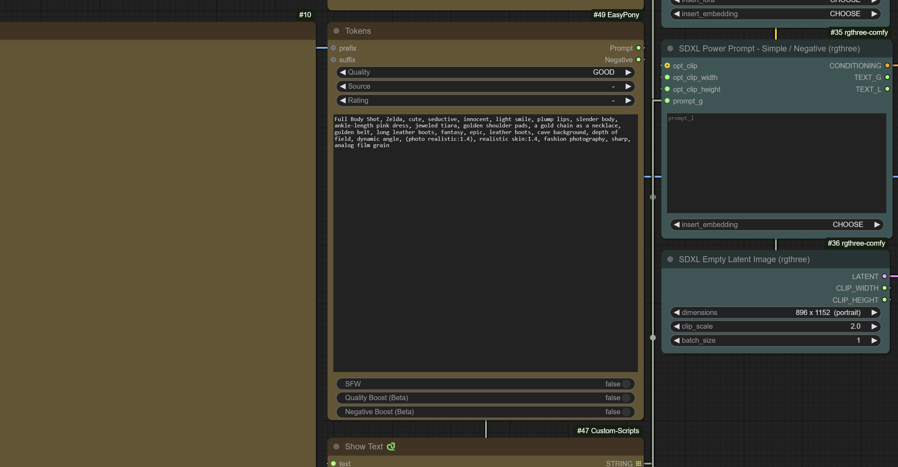

# ComfyUI Easy Pony

> [!WARNING]
> I have updated the node to be more self-contain and to be more user friendly. As of version 1.2.0 you are able to select you model and alter the last_clip parameter 
> directly on the node. A invert for source and rating has been added as well, allowing you to filter this content out in the negative direction. Anyone using the previous
> version of this node will need to update their flows to reflect the changes in the new version.

> [!NOTE]
> I am not a prolific user of Pony models; This node was created to assist in converting prompts for one of my other custom nodes. YMMV
> in terms of the quality of the prompts generated.

This custom node is an abstrtaction of a helper node used in one of my other `currently un-published` custom nodes. It was created
to simplify the process of adding scoring and other attributes when prompting with `Pony` models. It is the implementation of 4 different articles including one by the pony creator based on how to properly prompted when using the models. So yes it is in essence a prompt generator, but there is a method to the madness.

EasyPony - Resources for implementation of EasyPony prompt sturcture
- [prompting-for-score-or-source-or-rating-or-and-an-overview-of-prompting-syntax](https://civitai.com/articles/8547/prompting-for-score-or-source-or-rating-or-and-an-overview-of-prompting-syntax)
- [pony-diffusion-v6-xl-prompting-resources-and-info](https://civitai.com/articles/4871/pony-diffusion-v6-xl-prompting-resources-and-info)
- [what-is-score9-and-how-to-use-it-in-pony-diffusion](https://civitai.com/articles/4248/what-is-score9-and-how-to-use-it-in-pony-diffusion)
- [negative-prompt-for-pdxl-v2-works-with-other-models](https://civitai.com/articles/6160/negative-prompt-for-pdxl-v2-works-with-other-models)

## Usage

 `prefix` - The prefix to use for the prompt, this will replace the quailty score allowing you to use a
 custom score or any string unqiue to the model.
 `suffix` - The suffix to use for the prompt, will be placed at the end of the prompt.
 `model` - The model to use for the prompt - `Pony` models only
 `last_clip` - The last clip to use for the prompt, this will be used to determine the quality of the prompt based on the model training data.
 `source and rating` - acts as a filter for the model
 `invert source and rating` - acts as a filter for the model in the negative direction
 `SFW` - Safe for work, will filter out NSFW content
 `Quailty Boost` - Use negative strings to boost the quality of the prompt
 `Negative Boost` - Use negative strings to boost the negative aspects of the prompt

### Install from ComfyUI Manager

- Type `Easy Pony` on the search bar of [ComfyUI Manager](https://github.com/ltdrdata/ComfyUI-Manager).
- Click the install button.

### Manual Installation

To install `ComfyUI-EasyPony`:

1. Open the terminal in the ComfyUI `custom_nodes` folder.
2. Run: `git clone https://github.com/itsjustregi/ComfyUI-EasyPony`.
3. Restart ComfyUI.

### Update

To update `ComfyUI-EasyPony`:

1. Open the terminal in the `ComfyUI-EasyPony` folder.
2. Run: `git pull`.
3. Restart ComfyUI.

Parameters with null value (-) will not be included in the generated prompt.

## Practical Advice

Easy Pony is a helper node that simplifies the process of adding scoring and other attributes to the core when prompting with Pony models.
Model selection determines the quality of the images from the prompt. The effectiveness of the parameters depends on the quality of the checkpoint used.

## License

This project is licensed under the MIT License.